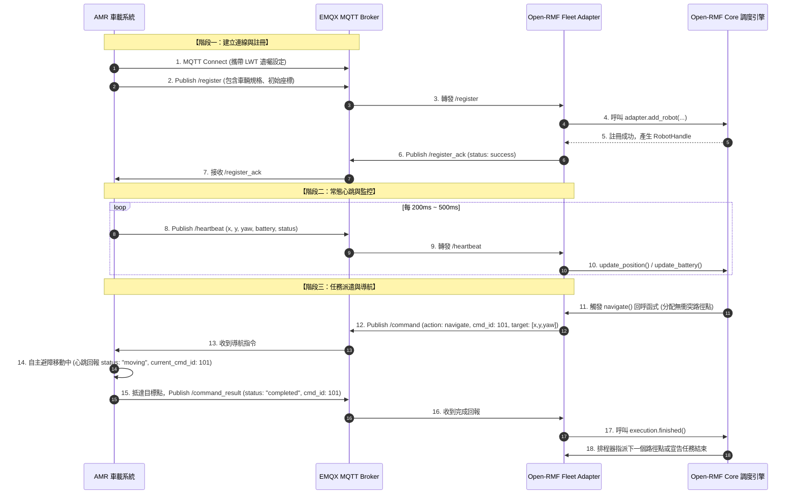
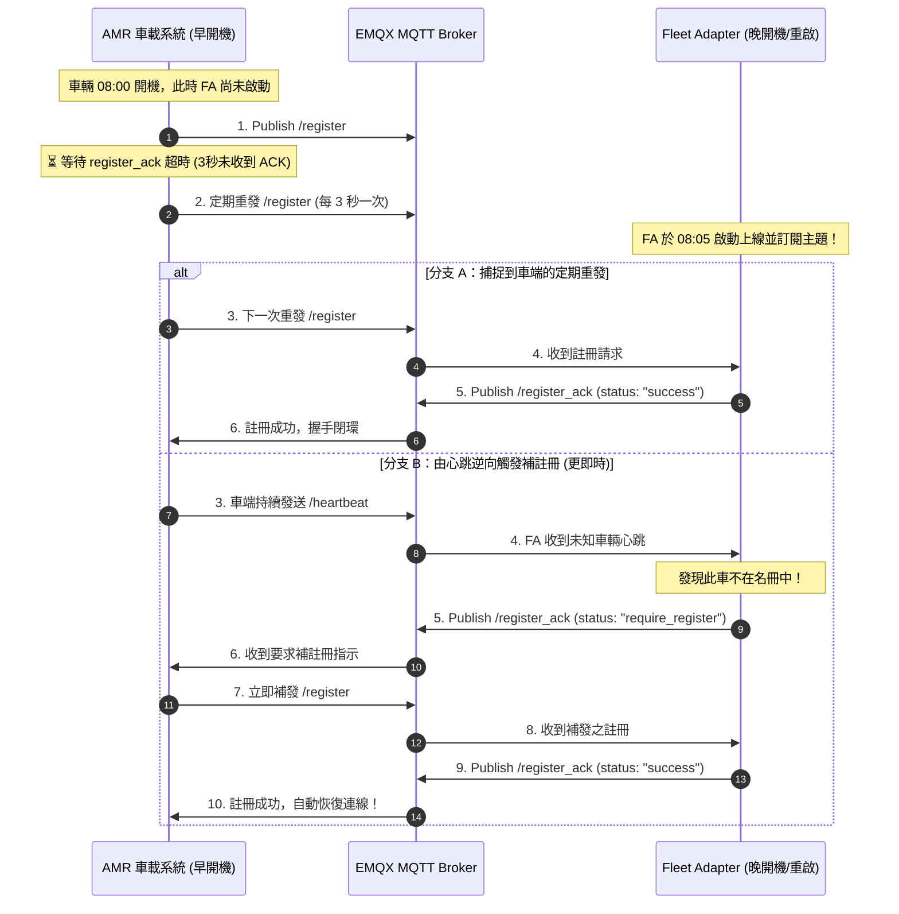

# AMR 車載端與 Open-RMF Fleet Adapter (FA) MQTT 通訊介面規格書

- **文件版本**：v1.0.0
- **修訂日期**：2026-10-07
- **適用對象**：AMR 車載軟體研發人員、車隊管理系統 (FMS) 開發團隊、系統整合工程師
- **目標系統**：Open-RMF Web Studio (ROS 2 Jazzy + EMQX MQTT Broker)

---

## 1. 概述 (Overview)

本規格書定義自主移動機器人（Autonomous Mobile Robot, 簡稱 **AMR**）與 Open-RMF **Fleet Adapter（車隊轉接器，簡稱 FA）** 之間的標準通訊介面。

本系統採用 **MQTT 3.1.1 / 5.0** 作為雙向通訊協定，具備以下架構特點：
1. **註冊與心跳分離 (Separation of Registration & Heartbeat)**：
   - **開機註冊 (`register`)**：包含車輛尺寸、動力性能、充電樁指派等靜態參數（低頻率、只在開機或重連時發送一次）。
   - **常態心跳 (`heartbeat`)**：包含即時座標、朝向角、電量與運作狀態（高頻率、極簡輕量 JSON 封包）。
2. **具備雙向握手機制 (Handshake)**：車輛於開機後需取得 FA 回覆的 `register_ack` 確認，方可進入可派遣（Online）狀態。
3. **優雅離線與意外斷網守護 (Graceful Deregister & LWT)**：支援正常關機註銷，並利用 MQTT **Last Will and Testament (LWT 遺囑訊息)** 機制防止車輛非預期斷電或失聯造成排程死鎖。

---

## 2. MQTT 連線規範與環境設定

### 2.1 Broker 連線參數
- **預設 Host**：`127.0.0.1`（本機 Docker 服務）或現場配置之 EMQX 伺服器 IP
- **預設連接埠 (Port)**：
  - `1883`：標準 MQTT TCP（推薦車載端使用）
  - `8883`：MQTT over TLS/SSL（安全傳輸）
  - `8083` / `8084`：MQTT over WebSocket / WSS
- **Client ID 命名規範**：
  ```text
  amr_{fleet_name}_{robot_id}
  ```
  *(範例：`amr_tinyRobot_tinyRobot1`，請確保同一個 Client ID 在整個 Broker 中唯一)*
- **Keep Alive 間隔**：建議設置為 `15` ~ `30` 秒。
- **Clean Session**：建議設置為 `True`。

### 2.2 座標系與單位標準 (ROS 2 / Open-RMF 標準)
車載端所有數值回報與指令解析均須嚴格遵循以下物理單位：

| 物理量 | 單位 | 符號 / 格式 | 說明 |
| :--- | :--- | :--- | :--- |
| **位置座標 $(x, y)$** | 公尺 (meters) | `float` (例如: `2.45`) | 參考 2D SLAM 地圖原點之右手直角座標系 |
| **朝向角度 $(\theta / yaw)$** | 弧度 (radians) | `float` (例如: `1.5708`) | 範圍 $[-\pi, +\pi]$，以 X 軸正向為 0，逆時針為正 |
| **線速度 $(v)$** | 公尺/秒 (m/s) | `float` (例如: `1.0`) | 車體正向移動速度 |
| **角速度 $(\omega)$** | 弧度/秒 (rad/s) | `float` (例如: `0.8`) | 車體旋轉角速度 |
| **電池電量 (Battery)** | 百分比 (%) | `float` (`0.0` ~ `100.0`) | 例如 `85.5` 代表 85.5% |
| **時間戳記 (Timestamp)** | 秒 (seconds) | `float` (Unix Epoch) | 秒級浮點數 (精確至毫秒，例如: `1728312000.123`) |

---

## 3. MQTT 主題總覽 (Topic Catalog)

主題採用階層式命名：`rmf/{fleet_name}/robot/{robot_id}/{action}`

| 主題名稱 (Topic) | 傳輸方向 | 推薦 QoS | 觸發頻率 | 職責簡述 |
| :--- | :---: | :---: | :---: | :--- |
| `rmf/{fleet_name}/robot/{robot_id}/register` | 車端 $\rightarrow$ FA | **1** | 開機發送 (未獲 ACK 則每 3 秒自動重試) | 提交車體規格並申請註冊進 Open-RMF |
| `rmf/{fleet_name}/robot/{robot_id}/register_ack` | FA $\rightarrow$ 車端 | **1** | 回應註冊請求時 | FA 確認接受註冊並回傳系統圖資配置 |
| `rmf/{fleet_name}/robot/{robot_id}/heartbeat` | 車端 $\rightarrow$ FA | **0** | 週期性 (1 ~ 5 Hz) | 回報即時位置、電量與當前運動狀態 |
| `rmf/{fleet_name}/robot/{robot_id}/command` | FA $\rightarrow$ 車端 | **1** | 事件觸發 (任務派遣) | RMF 核心派發之導航目標點或停止指令 |
| `rmf/{fleet_name}/robot/{robot_id}/command_result` | 車端 $\rightarrow$ FA | **1** | 動作完成或異常時 | 車端回報指定 `cmd_id` 之執行結果 |
| `rmf/{fleet_name}/robot/{robot_id}/deregister` | 車端 $\rightarrow$ FA | **1** | 正常關機或維護時 | 主動註銷並釋放預約路權與站點 |
| `rmf/{fleet_name}/robot/{robot_id}/status` | 車端 $\rightarrow$ FA | **1** | 斷線時 (LWT 遺囑) | 遺囑訊息：非預期失聯時由 Broker 代發 |

---

## 4. 詳細通訊封包規格 (Payload Specifications)

### 4.1 開機註冊請求 (`register`)
- **Topic**：`rmf/{fleet_name}/robot/{robot_id}/register`
- **方向**：車載端 $\rightarrow$ Fleet Adapter
- **QoS**：`1`
- **觸發與發送時機**：
  1. **開機首次發送**：車輛系統啟動完成且定位成功後立即發送。
  2. **3 秒自動重試機制（晚開機應對）**：發送後**若超過 3 秒未收到 `register_ack`**（例如 Fleet Adapter 較晚啟動或重啟中），車端**必須以 3 秒為間隔持續自動重發**，直到收到 `status: "success"` 的 ACK 為止。
  3. **逆向要求重註冊**：若車輛運行中收到 `register_ack` 帶有 `status: "require_register"`（代表 FA 剛重啟遺失了名冊），車端**必須立即重新發送**此註冊封包。
- **說明**：告知 FA 該車輛的物理幾何形狀與預設站點。未完成註冊前，車輛不可切換至 `idle` 亦不可接受調度指令。

#### JSON Schema 與欄位定義
```json
{
  "robot_id": "tinyRobot1",
  "fleet_name": "tinyRobot",
  "timestamp": 1728312000.123,
  "initial_location": {
    "x": 0.7,
    "y": 0.9,
    "yaw": 0.0,
    "level_name": "L1",
    "waypoint_name": "wp_1"
  },
  "specs": {
    "footprint_radius": 0.35,
    "max_linear_velocity": 1.2,
    "max_angular_velocity": 1.0
  },
  "default_charger": "charger_1",
  "default_parking": "parking_1"
}
```

| 欄位名稱 | 型別 | 必填 | 說明 |
| :--- | :---: | :---: | :--- |
| `robot_id` | String | **是** | 車輛唯一識別碼 (需與 Client ID 相符) |
| `fleet_name` | String | **是** | 所屬車隊名稱 (需與 FA 管理之車隊名稱相符) |
| `timestamp` | Float | **是** | 發送時之 Unix 時間戳記 (秒) |
| `initial_location.x` | Float | **是** | 開機完成時的定位 X 座標 (m) |
| `initial_location.y` | Float | **是** | 開機完成時的定位 Y 座標 (m) |
| `initial_location.yaw` | Float | **是** | 開機完成時的車頭朝向角 (rad) |
| `initial_location.level_name` | String | 否 | 所在樓層地圖，預設 `"L1"` |
| `initial_location.waypoint_name` | String | 否 | 若停在特定站點，填寫站點名稱 (例: `"parking_1"`) |
| `specs.footprint_radius` | Float | 否 | 車體迴轉安全半徑 (m)，預設使用 FA 配置 |
| `specs.max_linear_velocity` | Float | 否 | 車輛最大線速度 (m/s) |
| `specs.max_angular_velocity`| Float | 否 | 車輛最大角速度 (rad/s) |
| `default_charger` | String | 否 | 該車指定充電樁名稱 (若無則使用車隊預設) |
| `default_parking` | String | 否 | 該車指定待命停泊點名稱 |

---

### 4.2 註冊應答 (`register_ack`)
- **Topic**：`rmf/{fleet_name}/robot/{robot_id}/register_ack`
- **方向**：Fleet Adapter $\rightarrow$ 車載端
- **QoS**：`1`
- **說明**：FA 收到 `register` 並在 Open-RMF 建立 `RobotUpdateHandle` 成功後回覆。車載端必須收到此訊息才能開始發送日常心跳並接受指令。

#### 成功範例 (Success)
```json
{
  "robot_id": "tinyRobot1",
  "status": "success",
  "message": "Robot registered to Open-RMF scheduler successfully",
  "assigned_graph_idx": 0,
  "server_time": 1728312000.456
}
```

#### 拒絕範例 (Rejected)
```json
{
  "robot_id": "tinyRobot1",
  "status": "error",
  "error_code": "GRAPH_OUT_OF_BOUNDS",
  "message": "Initial location is too far from any valid waypoint in nav graph 0",
  "server_time": 1728312000.456
}
```

#### 晚啟動/重啟要求補註冊範例 (Require Registration)
```json
{
  "robot_id": "tinyRobot1",
  "status": "require_register",
  "message": "Robot not recognized by FA, please re-register immediately",
  "server_time": 1728312000.456
}
```
> **重要自癒機制**：若 FA 比車輛晚開機、或 FA 曾中途重啟，當 FA 收到未知心跳時會主動發送此訊息。車載端收到 `status: "require_register"` 時，**必須立即自動補發 `/register`**。

---

### 4.3 週期心跳與遙測 (`heartbeat`)
- **Topic**：`rmf/{fleet_name}/robot/{robot_id}/heartbeat`
- **方向**：車載端 $\rightarrow$ Fleet Adapter
- **QoS**：`0`
- **建議發送頻率**：`2 Hz` ~ `5 Hz` (每 200ms ~ 500ms 一次)
- **說明**：包含車輛識別碼與 Open-RMF 交通調度與避障所必需的 7 個標準欄位。自包含 `robot_id` 有助於日誌追蹤與封包除錯。

#### 核心標準 JSON 封包範例 (7 個標準欄位)
```json
{
  "robot_id": "tinyRobot1",
  "x": 2.345,
  "y": 1.120,
  "yaw": 0.785,
  "battery": 88.5,
  "status": "moving",
  "current_cmd_id": 101
}
```

| 欄位名稱 | 型別 | 必填 | 單位 / 範圍 | 說明與 Open-RMF 對應 |
| :--- | :---: | :---: | :---: | :--- |
| **`robot_id`** | String | **是** | 字串 (例: `"tinyRobot1"`) | 車輛唯一識別碼 (需與註冊及 Topic 一致) |
| **`x`** | Float | **是** | 公尺 (m) | 當前 2D SLAM 世界座標 X $\rightarrow$ `RobotState.position[0]` |
| **`y`** | Float | **是** | 公尺 (m) | 當前 2D SLAM 世界座標 Y $\rightarrow$ `RobotState.position[1]` |
| **`yaw`** | Float | **是** | 弧度 (rad, $[-\pi, \pi]$) | 車頭偏航角（逆時針為正） $\rightarrow$ `RobotState.position[2]` |
| **`battery`** | Float | **是** | 百分比 (`0.0` ~ `100.0`) | 電池電量（FA 自動轉為 RMF SoC: 0.0~1.0） |
| **`status`** | String | **是** | `"idle"` \| `"moving"` \| `"charging"` \| `"error"` | 當前運作狀態 |
| **`current_cmd_id`** | Integer / Null | **是** | 整數編號 或 `null` | 正在執行的指令 ID（待命未接單時為 `null`，移動時為任務號） |

> **選填補充欄位**（單樓層場域可完全省略）：
> - `level_name` (String): 多樓層場域時標記所在樓層（省略時預設使用開機註冊的樓層 `"L1"`）。

---

### 4.4 RMF 下發指令 (`command`)
- **Topic**：`rmf/{fleet_name}/robot/{robot_id}/command`
- **方向**：Fleet Adapter $\rightarrow$ 車載端
- **QoS**：`1`
- **說明**：由 Open-RMF 交通調度器計算出無衝突路徑點後，由 FA 派發至車端執行。

#### 1. 前往目標點 (Navigate / Goto)
```json
{
  "robot_id": "tinyRobot1",
  "cmd_id": 101,
  "action": "navigate",
  "target": {
    "x": 5.40,
    "y": 7.80,
    "yaw": 1.5708,
    "level_name": "L1"
  },
  "speed_limit": 1.0,
  "timestamp": 1728312005.100
}
```

#### 2. 靠泊/充電對齊 (Dock)
```json
{
  "robot_id": "tinyRobot1",
  "cmd_id": 102,
  "action": "dock",
  "dock_name": "charger_1",
  "target": {
    "x": 0.7,
    "y": -4.43,
    "yaw": 0.0,
    "level_name": "L1"
  },
  "timestamp": 1728312010.500
}
```

#### 3. 緊急停止 / 暫停 (Stop / Pause)
```json
{
  "robot_id": "tinyRobot1",
  "cmd_id": 103,
  "action": "stop",
  "reason": "Traffic conflict pause by RMF schedule",
  "timestamp": 1728312015.000
}
```

---

### 4.5 指令完成或異常回報 (`command_result`)
- **Topic**：`rmf/{fleet_name}/robot/{robot_id}/command_result`
- **方向**：車載端 $\rightarrow$ Fleet Adapter
- **QoS**：`1`
- **說明**：車端接收到 `command` 並完成該階段動作（或發生被障礙物阻擋等錯誤）時發送。

```json
{
  "robot_id": "tinyRobot1",
  "cmd_id": 101,
  "status": "completed",
  "message": "Target reached within tolerance",
  "final_location": {
    "x": 5.398,
    "y": 7.802,
    "yaw": 1.569
  },
  "timestamp": 1728312020.300
}
```

`status` 列舉值：
- `"completed"`：成功抵達目標點或完成對位。
- `"failed"`：遇到死路或硬體故障無法抵達。
- `"canceled"`：車端收到新指令覆蓋或收到 `stop` 成功中斷。

---

### 4.6 正常離線註銷 (`deregister`)
- **Topic**：`rmf/{fleet_name}/robot/{robot_id}/deregister`
- **方向**：車載端 $\rightarrow$ Fleet Adapter
- **QoS**：`1`
- **說明**：車輛欲關機、回廠保養或切換為手動遙控 (Manual) 前發送，告知 RMF 釋放其排程資源。

```json
{
  "robot_id": "tinyRobot1",
  "fleet_name": "tinyRobot",
  "reason": "Shutdown maintenance",
  "timestamp": 1728312100.000
}
```

---

### 4.7 異常失聯防護：MQTT 遺囑訊息 (LWT)
- **Topic**：`rmf/{fleet_name}/robot/{robot_id}/status`
- **QoS**：`1`
- **Retained**：`False`
- **說明**：車載端在建立 MQTT 連線時，**必須**向 Broker 設定遺囑訊息 (Will Message)。若車輛遭遇異常斷電或無線訊號中斷，EMQX Broker 會立即自動發布此訊息給 FA。

#### 車端建立 MQTT 連線時設定之 LWT 內容：
```json
{
  "robot_id": "tinyRobot1",
  "status": "offline",
  "reason": "Unexpected connection loss (LWT triggered)",
  "timestamp": 1728312200.000
}
```

---

## 5. 車輛完整生命週期與狀態機 (State Machine & Sequence)

### 5.1 開機與任務派遣循序圖



### 5.2 晚啟動與斷線自癒機制循序圖 (Late Startup & Reconnection)

當車載端比 FA 提早開機、或 FA 伺服器中途當機重開時，系統透過以下雙層防護機制在 1 秒內自動修復連線：



---

## 6. 車載端實作檢查清單 (Implementation Checklist)

車載工程師在撰寫對接模組時，請依照下列項目自我檢查：

- [ ] **坐標系校正**：確認車端傳出的座標系原點與 SLAM 2D 地圖的原點完全一致（右手定則，角度逆時針為正）。
- [ ] **連線設置 LWT**：連線時是否已設定 `.../status` 的遺囑訊息？
- [ ] **握手確認**：開機後是否確實等待 `register_ack` 回覆成功後，才將車況設定為 `idle`？
- [ ] **註冊定時重試**：發出 `/register` 後若超過 3 秒未收到 ACK，是否具備定時重試重發機制？
- [ ] **斷線自癒支援**：若收到 `register_ack` 為 `status: "require_register"`，是否立即自動補發 `/register`？
- [ ] **指令確認 (cmd_id 追蹤)**：收到 `/command` 後，心跳中的 `current_cmd_id` 是否有對應更新？完成時是否送出包含同一個 `cmd_id` 的 `command_result`？
- [ ] **心跳頻率穩定**：心跳維持在 2~5 Hz，避免過低造成 RMF 誤判為掉線，亦避免高於 20 Hz 浪費頻寬。
- [ ] **角度範圍規範**：朝向角度是否嚴格限制在 $[-\pi, +\pi]$（約 $-3.14159$ 至 $+3.14159$）之間？
- [ ] **正常關機處理**：在車體主程式關閉時，是否發送 `/deregister` 告知 FA？
