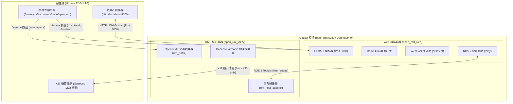
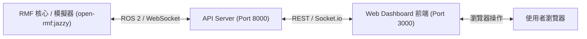
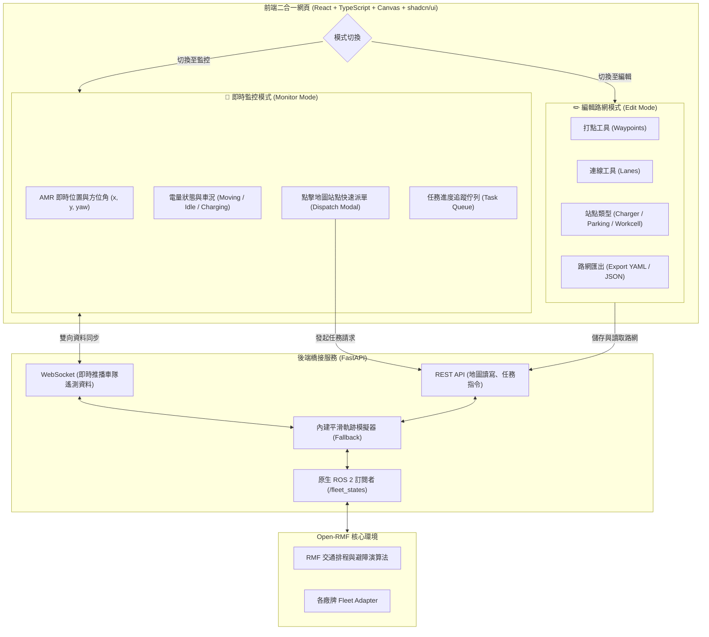
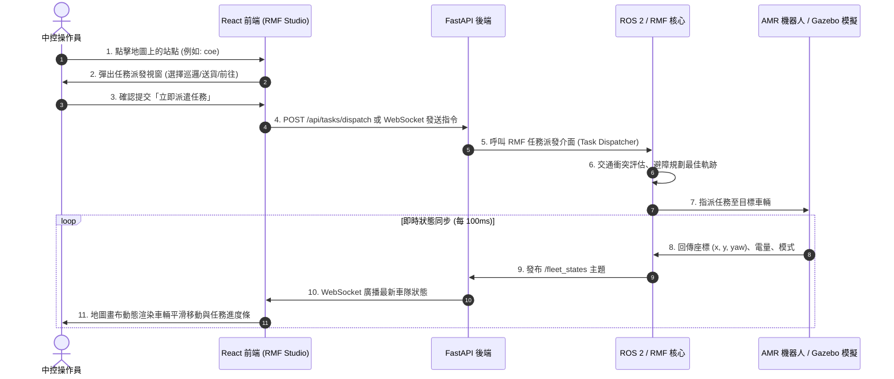

# Open-RMF Web Studio 系統架構文檔

本文檔說明本專案的整體系統架構、前後端整合設計、Docker 容器掛載關係，以及 Open-RMF 的資料通訊流。

---

## 一、系統整體架構 (System Overview)

本系統整合了 **Open-RMF 核心調度引擎**、**FastAPI 後端橋接服務** 與 **React + shadcn/ui 前端互動介面**，前後端皆掛載於同一個 ROS 2 Jazzy Docker 環境中。

---

## 二、Open-RMF 官方標準架構 vs 本專案整合架構

### 1. 官方標準前後端分離架構
在 Open-RMF 官方標準設計中，核心與 Web 是分離的微服務：

### 2. 本專案「編輯 + 監控二合一」整合架構
為解決官方 Web 只能監控、無法線上拉線標點的限制，本專案將**「路網編輯器 (Graph Editor)」**與**「即時監控派單中心 (Fleet Monitor)」**整合至單一 Web 應用中：

---

## 三、任務派遣與資料流序向圖 (Sequence Diagram)

以下展示中控人員於網頁端點選地圖進行「任務派遣」至車輛實際移動的完整資料生命週期：

---

## 四、目錄結構與 Docker 掛載映射

專案所有程式碼皆置於宿主機，透過 Docker Compose 雙向 Volume 掛載至容器內部：

| 宿主機路徑 | 容器內掛載路徑 | 說明 |
| :--- | :--- | :--- |
| `./backend` | `/root/rmf_ws/backend` | FastAPI 後端伺服器與 ROS 2 橋接程式 |
| `./frontend` | `/root/rmf_ws/frontend` | React + Vite 前端原始碼與建置產物 (`dist/`) |
| `./workspace` | `/root/rmf_ws/src/custom_ws` | 自訂 ROS 2 節點、自製 Fleet Adapter 或地圖設定檔 |
| `/tmp/.X11-unix` | `/tmp/.X11-unix` | X11 畫面通道（支援 Gazebo 與 RViz2 視窗顯示） |

### 服務埠號 (Ports)
- **`8000`**：FastAPI 後端 API、WebSocket 伺服器與 React 前端託管入口 (`http://localhost:8000`)
- **`5173`**：Vite 開發伺服器（於宿主機執行 `npm run dev` 時使用）

---

## 五、路網持久化與 SLAM 底圖儲存機制 (Map Persistence & SLAM Map)

本系統具備完整的伺服器端與本地雙層持久化機制，編輯好的路網不會因網頁重新整理或容器重啟而遺失：

1. **路網持久化檔案 (`./backend/saved_maps/`)**：
   - **`active_nav_graph.json`**：保留完整頂點、路徑與前端介面屬性，供前端開機自動載入。
   - **`active_nav_graph.yaml`**：自動即時轉譯為標準 Open-RMF Building Map 規格（包含 `vertices`、`lanes`、`is_charger`、`is_parking_spot`、`is_workcell` 等屬性），可直接作為 Open-RMF 導航排程器與 Fleet Adapter 的輸入檔。
2. **SLAM 雷達底圖存儲 (`./backend/uploads/`)**：
   - 上傳的 `.pgm` 與 `map.yaml` 會自動轉譯為 PNG 與空間解析度參數，並與 YAML 中的 `drawing.filename` 關聯。
3. **前端自動恢復與快取機制**：
   - 當瀏覽器載入時，自動向 `GET /api/map` 請求最新儲存的路網；若離線則以 `localStorage` 雙層容災載入。
   - 點擊頂部導航列「💾 儲存路網」即可一鍵寫入硬碟並透過 WebSocket 廣播更新至所有連線用戶端。

---

## 六、前後端分離開發工作流 (Decoupled Development Workflow)

為了提供最流暢的開發體驗，系統支援前後端獨立運作的模式：

1. **後端服務 (Backend Service)**：
   - 運行於 Docker 容器內，提供 FastAPI REST API 與 WebSocket 車隊資料串流 (`http://localhost:8000`)。
2. **前端服務 (Frontend Vite Dev Server)**：
   - 運行於本機 Node.js 環境 (`http://localhost:5173`)，具備秒級熱模組替換 (HMR)。
   - 任何在 VS Code 中的程式碼修改（UI、樣式、狀態邏輯）存檔後瞬間在瀏覽器呈現，**完全不需執行 `npm run build`**。
3. **透明反向代理 (Reverse Proxy)**：
   - 透過 `frontend/vite.config.ts` 中的 `proxy` 配置，前端送往 `/api` 與 `/ws` 的所有請求會自動無縫轉發至後端 Port `8000`，解決 CORS 跨來源問題。
4. **一鍵啟動腳本**：
   - 專案根目錄已建立 `./start_dev.sh`，執行即可同時確保後端 Docker 運行並啟動前端熱重載環境。

